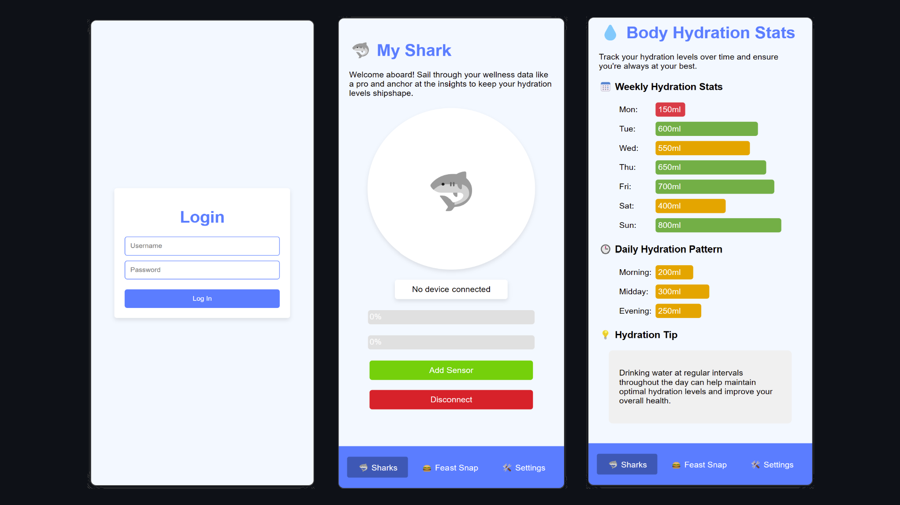
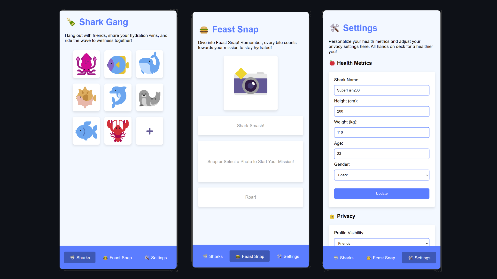

# 🦈 Smart Hydration Assurance and Replenishment Key Solution (SHARKS) 🦈

SHARKS is an innovative health application demo designed for the CMU 14-744 Mobile and Embedded Software Design. This demo showcases a technical proof of concept for monitoring hydration levels smartly and reliably using embedded systems.

